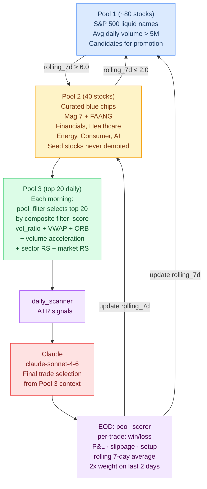
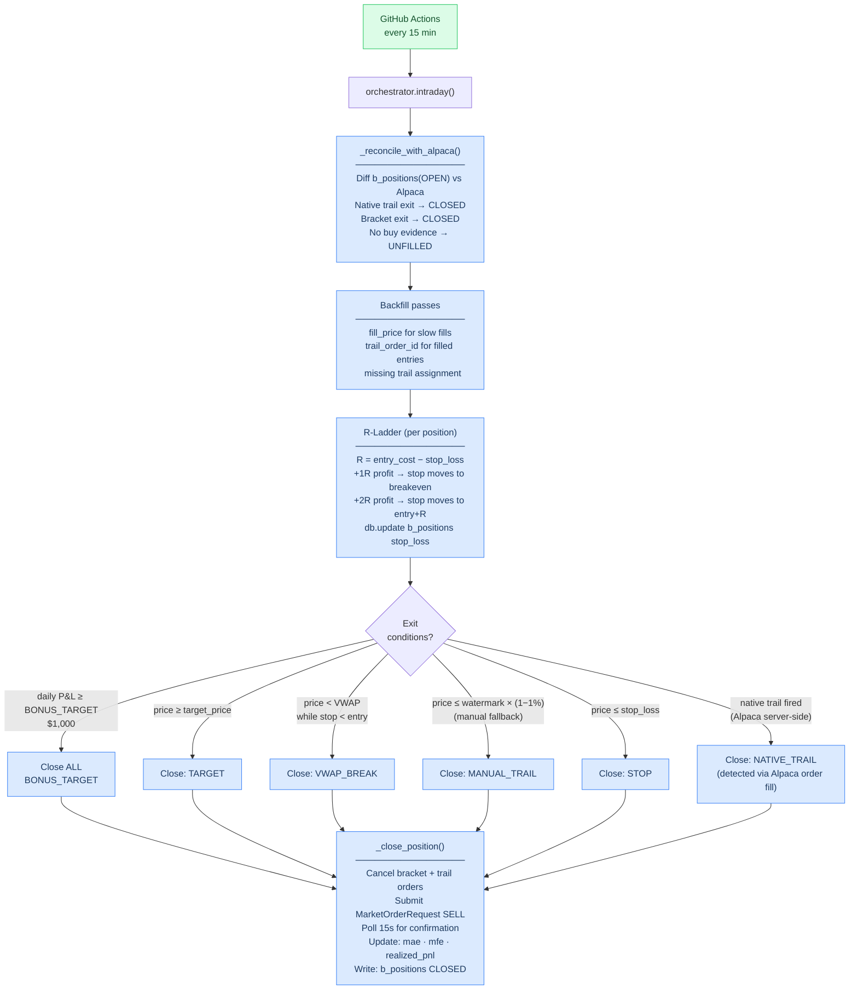
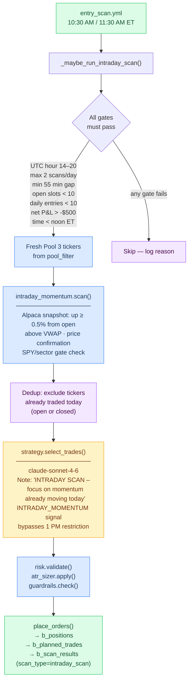
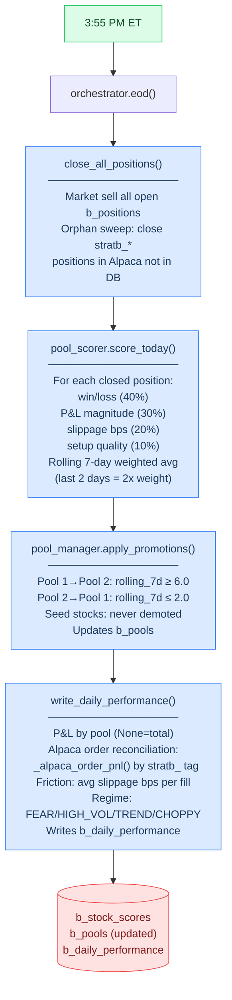
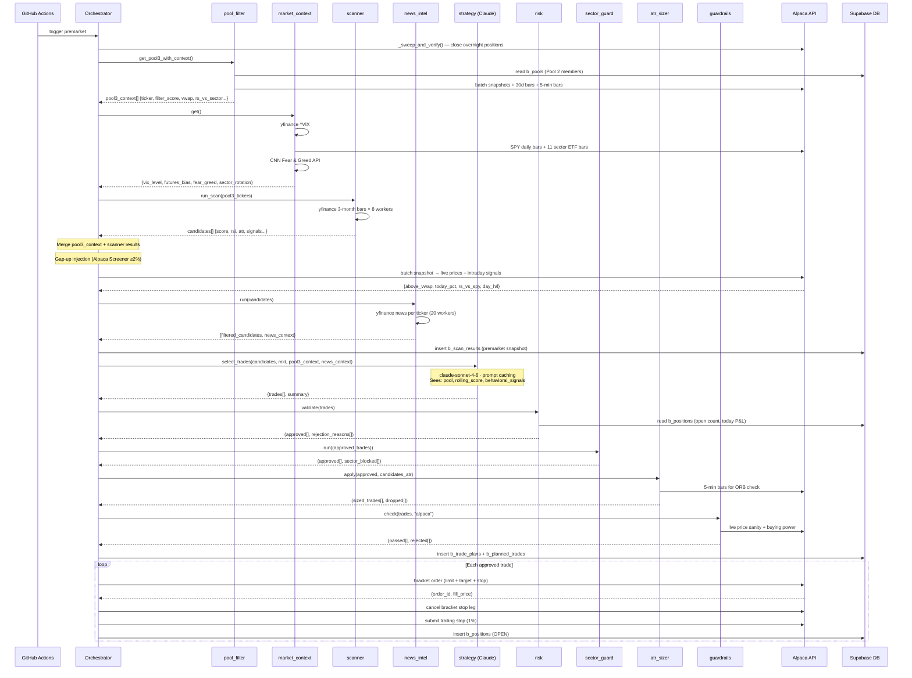
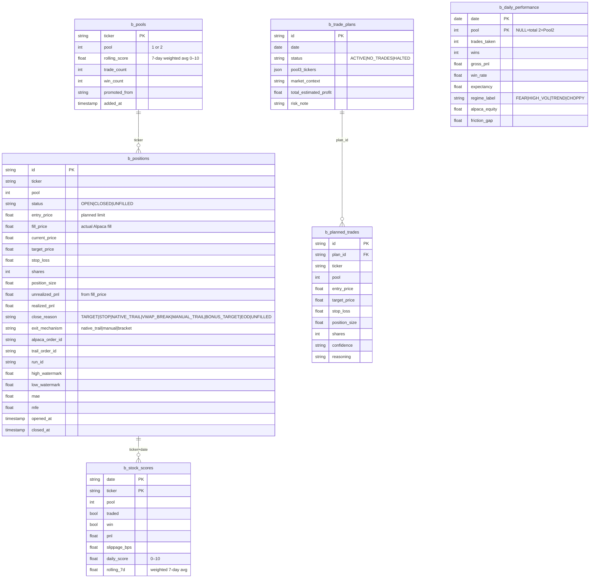
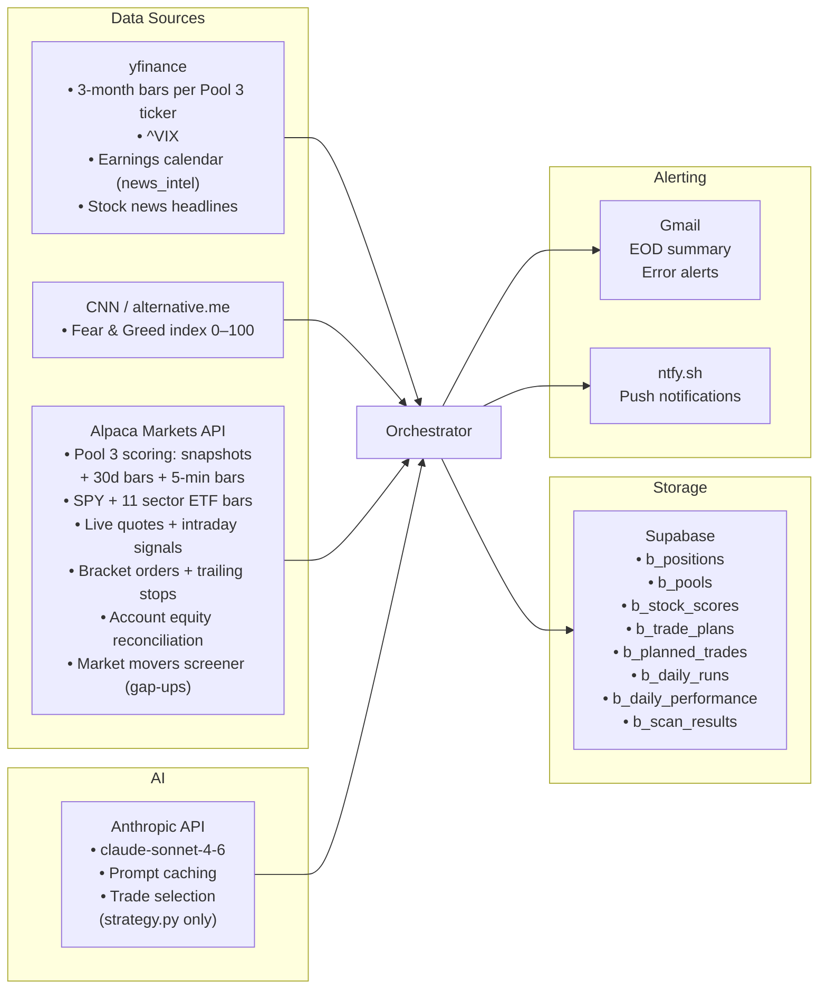

# Strategy B — Architecture

Blue chip pool-based pipeline. A three-tier pool system curates stocks behaviorally over time so Claude sees only battle-tested candidates with a performance track record. Two daily entry paths: premarket scan at 10 AM and two intraday momentum scans at 10:30 AM / 11:30 AM.

---

## Daily Schedule

```
10:00 AM ET   trading.yml → premarket   Pool 3 → scan → Claude → orders
10:00–3:59 PM trading.yml → intraday    Every 15 min: sync, trail/stop/target exits
10:30 AM ET   entry_scan.yml            Intraday momentum scan #1
11:30 AM ET   entry_scan.yml            Intraday momentum scan #2
 3:55 PM ET   trading.yml → eod         Force-close, score, pool promotions, write performance
```

---

## Pool System — The Core Differentiator



---

## Full Premarket Pipeline

```mermaid
flowchart TD
    GHA["GitHub Actions\n10:00 AM ET"]:::infra --> PM["orchestrator.premarket()"]

    PM --> CHECKS["Pre-checks\n─────────────────\n_is_trading_day() — Alpaca calendar\n_is_halted() — b_scan_results\nDuplicate guard — b_trade_plans\n_sweep_and_verify() — close overnight"]:::filter

    CHECKS --> POOL3["① pool_filter.get_pool3_with_context()\n─────────────────\nReads b_pools (Pool 2)\n3 Alpaca batch calls:\n  snapshots · 30d daily bars · 5-min bars\nScores by: vol_ratio + VWAP reclaim\n  + ORB breakout + vol_acceleration\n  + sector RS + market RS + return\nReturns top 20 by filter_score"]:::agent

    POOL3 --> MC["② market_context.get()\n─────────────────\nyfinance: ^VIX\nAlpaca: SPY daily bars (futures_bias)\nCNN API: Fear & Greed 0–100\nAlpaca: 11 sector ETF daily bars"]:::agent

    MC --> SCAN["③ scanner.run_scan(pool3_tickers)\n─────────────────\nyfinance: 3-month daily bars\n8 parallel workers\nRSI(14) · MACD · Bollinger\nSMA20/50 · ATR(14)\nbehavioral signals"]:::agent

    SCAN --> MERGE["Pool 3 fill-in\npool_filter data fills gaps\nwhere yfinance scanner missed\npool3 tickers"]:::filter

    MERGE --> GAP["③.1 Gap-up injection\n─────────────────\nAlpaca Screener ≥2% movers\nFilter to Pool 3 only\nTop 20, not already scanned"]:::agent

    GAP --> GFILTER["③.15 Garbage filter\nprice > 0 AND rsi ≠ None"]:::filter

    GFILTER --> ENRICH["③.2 Live price + signals (parallel)\n─────────────────\nAlpaca StockLatestQuoteRequest → ask\nAlpaca StockSnapshotRequest:\n  above_vwap · vwap · today_pct\n  rs_vs_spy · day_high · day_low\nExtension filter: >3% + vol<0.7x\nORB: logged, not hard-gated\nTop-of-range: >85% day range"]:::agent

    ENRICH --> NEWS["③.5 news_intel.run(candidates)\n─────────────────\nyfinance .news per ticker\n20 workers · 30s timeout\nEarnings blackout DISABLED\nPasses news_context to Claude"]:::agent

    NEWS --> CAP["③.8 Trade cap\ntop N by technical_score\nMax: min(MAX_DAILY_ENTRIES, max_positions)"]:::filter

    CAP --> CLAUDE["④ strategy.select_trades()\n─────────────────\nModel: claude-sonnet-4-6\nPrompt caching (ephemeral)\nClaude sees per-stock:\n  pool · rolling_score · above_vwap\n  rs_vs_sector · atr_ratio\n  behavioral_signals · technical_score\nTime-of-day rules in system prompt"]:::llm

    CLAUDE --> RISK["⑤ risk.validate(trades)\n─────────────────\nMTM loss limit check\nMax positions (10)\nSector cap (2 per sector)\nDuplicate guard\nR:R ≥ 1.4"]:::agent

    RISK --> SG["⑤.5 sector_guard.run()\n─────────────────\nSECTOR_MAP from blue_chips.py\nMax 2 per sector\nDrops lowest confidence excess"]:::agent

    SG --> ATR["⑤.7 atr_sizer.apply()\n─────────────────\nStop = max(ATR × 1.2, 0.5%)\n$150 constant dollar risk\nORB < 0.5×ATR → halve shares\nDrops if R:R < MIN_REWARD_RISK"]:::agent

    ATR --> GUARD["⑥ guardrails.check()\n─────────────────\nRequired fields\nBUY-only\nFormula validation (8% target)\nLive price sanity ±5% (Alpaca)\nBuying power (Alpaca account)"]:::agent

    GUARD --> SAVE["⑦ Save plan\nb_trade_plans + b_planned_trades\nb_daily_runs (premarket)"]:::db

    SAVE --> ORDERS["⑧ place_orders()\n─────────────────\nAlpaca bracket order:\n  entry: limit (hybrid bid/mid)\n  target: limit take-profit (8%)\n  stop: stop-loss leg\nTrail: cancel bracket stop,\n  submit native TrailingStopRequest\nOrder prefix: stratb_{ticker}_{ts}"]:::infra

    ORDERS --> DBPOS[("b_positions\n(status=OPEN)\nfill_price · watermarks\nalpaca_order_id · trail_order_id")]:::db

    classDef agent fill:#dbeafe,stroke:#3b82f6,color:#1e3a5f
    classDef llm fill:#fef3c7,stroke:#f59e0b,color:#78350f
    classDef filter fill:#f3e8ff,stroke:#a855f7,color:#4a044e
    classDef infra fill:#dcfce7,stroke:#22c55e,color:#14532d
    classDef db fill:#fee2e2,stroke:#ef4444,color:#7f1d1d
```



---

## Intraday Position Management (Every 15 min)



---

## Entry Scan (10:30 AM & 11:30 AM ET)



---

## EOD Session



---

## Agent Handshakes — Premarket Sequence



---

## Data Model



---

## External Integrations



---

## Key Configuration

| Setting | Value | Effect |
|---|---|---|
| `TOTAL_CAPITAL` | $50,000 | Account size |
| `DAILY_PROFIT_TARGET` | $500 | Daily goal |
| `MAX_POSITIONS` | 10 | Concurrent open cap |
| `MAX_DAILY_ENTRIES` | 10 | Total new opens per day |
| `POSITION_SIZE_BY_CONFIDENCE` | HIGH=$3.5K / MED=$3K / LOW=$2.5K | Risk-based sizing |
| `TARGET_PCT` | 8% | Profit ceiling |
| `MIN_REWARD_RISK` | 1.4 | Min R:R (risk check), 2.0 after ATR |
| `ATR_STOP_MULTIPLIER` | 1.2 | Stop = ATR × 1.2 |
| `ATR_STOP_FLOOR` | 0.5% | Minimum stop width |
| `MAX_LOSS_DOLLARS` | $150 | Constant dollar risk per trade |
| `DAILY_LOSS_LIMIT` | -$500 | Gate: no new trades |
| `DAILY_BONUS_TARGET` | $1,000 | Close all: lock in the day |
| `TRAIL_PCT` | 1% | Native Alpaca trailing stop |
| `POOL_PROMOTION_SCORE` | 6.0 | Pool 1 → Pool 2 threshold |
| `POOL_DEMOTION_SCORE` | 2.0 | Pool 2 → Pool 1 threshold |
| `POOL3_SIZE` | 20 | Daily elite picks |
| `MAX_PER_SECTOR` | 2 | Sector concentration cap |
| `INTRADAY_SCAN_MAX_RUNS` | 2 | Max entry scans per day |
| `INTRADAY_ENTRY_CUTOFF_UTC` | 16 | Hard cutoff at noon ET |
| `STRATEGY_TAG` | `stratb` | Alpaca order prefix for isolation |

---

## What Makes Strategy B Different from A

| Dimension | Strategy A | Strategy B |
|---|---|---|
| Universe | 430+ broad scan | 40 curated blue chips (Pool 2) |
| Candidate selection | Scanner score only | pool_filter composite score: vol_ratio + VWAP + ORB + acceleration + RS |
| Claude's context | Raw technical data | + pool membership + rolling_score (7-day P&L quality) + behavioral signals |
| Feedback loop | None | EOD scoring → pool promotions/demotions → next day's candidates |
| Intraday entries | entry_scan re-runs premarket pipeline | Dedicated momentum scan via intraday_momentum.scan() |
| Stop ratchet | None | R-ladder: breakeven at +1R, entry+R at +2R |
| Sector limit | None | Max 2 positions per sector (b_pools sector mapping) |
| EOD reconciliation | P&L from our fills | + Alpaca order reconciliation by stratb_ tag + friction breakdown |
| Shared account | Positions tagged stra_ | Positions tagged stratb_, orphan sweep on EOD |
